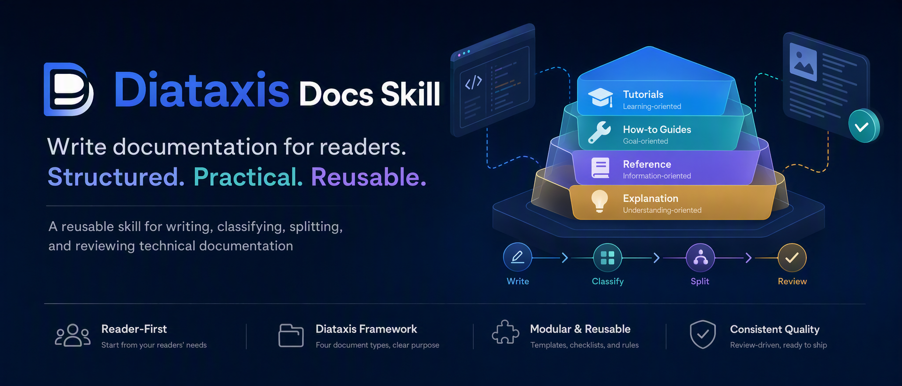

<div align="center">



<br>

[](LICENSE)
[](#install)
[](#which-assistants-can-use-it)
[](https://diataxis.fr/)
[](evals/evals.json)

**[中文](README.zh-CN.md)** &nbsp;·&nbsp; [Install](#install) &nbsp;·&nbsp; [What it does](#what-it-actually-does) &nbsp;·&nbsp; [Commands](#commands) &nbsp;·&nbsp; [Docs](docs/installation.md)

</div>

---

## Most docs problems are classification problems

A page that teaches a beginner, guides a working user, lists API fields, and explains design tradeoffs **fails all four readers at once**. The beginner cannot find the lesson. The working user cannot find the steps. The expert cannot find the field they came for. The maintainer does not know where new content belongs.

The prose can be excellent and the page still fails.

This skill makes an AI assistant decide *what kind of document is needed* before it writes anything.

## What it actually does

Give it a page that does four jobs. It tells you which four documents that page should have been, and drafts each one.

```text
INPUT   "Getting Started with QuokkaDB"  ── one page, four jobs

        ├─ Introduction ........................ 💡 explanation
        ├─ Why we built QuokkaDB ............... 💡 explanation
        ├─ Quick install, first connection ..... 🎓 tutorial
        │    └─ What just happened ............. 💡 explanation  ← wrong page
        ├─ Common tasks ........................ 🔧 how-to
        ├─ Reference ........................... 📖 reference
        ├─ Troubleshooting ..................... 🔧 how-to
        └─ Next steps .......................... ·  link farm, no form

OUTPUT  4 single-purpose pages
        🎓  Tutorial: Your first QuokkaDB program
              What you will build · Prerequisites · Steps
              What just happened · Where to go next
        🔧  How-to: Configure a QuokkaDB connection
              Goal · Steps · Run a transaction · Results · See also
        📖  Reference: QuokkaDB Python client
              Connection options · Functions · Error codes · Limits
        💡  Explanation: Why QuokkaDB chose an LSM-tree engine
              Origin · Why ACID · Why an LSM-tree · Implications
```

That is a real worked example, not an illustration — the before-and-after pages are in [`examples/messy-to-diataxis/`](examples/messy-to-diataxis/).

Critically, it also says **what to leave out of each page**. A tutorial that grows a "Background" section has stopped being a tutorial.

## How it decides

Two questions, four answers. This is the Diataxis compass:

<table>
<tr><th align="left">If the content…</th><th align="left">…and serves the user's…</th><th align="left">…then it belongs to…</th></tr>
<tr><td>informs <b>action</b></td><td><b>acquisition</b> of skill</td><td>🎓 &nbsp;a <b>tutorial</b></td></tr>
<tr><td>informs <b>action</b></td><td><b>application</b> of skill</td><td>🔧 &nbsp;a <b>how-to guide</b></td></tr>
<tr><td>informs <b>cognition</b></td><td><b>application</b> of skill</td><td>📖 &nbsp;<b>reference</b></td></tr>
<tr><td>informs <b>cognition</b></td><td><b>acquisition</b> of skill</td><td>💡 &nbsp;<b>explanation</b></td></tr>
</table>

And each form has rules the assistant applies while writing:

| Form | Reader is | Must have | Must **not** have |
| :--- | :--- | :--- | :--- |
| 🎓 Tutorial | learning | one linear path, visible results, stated prerequisites | branches, options, background essays |
| 🔧 How-to | working | one goal, short sequence, a verification step | teaching, concept introductions |
| 📖 Reference | looking up | structure mirroring the thing described, exact values | instructions, recommendations, hedging |
| 💡 Explanation | reflecting | one bounded topic, a point of view, tradeoffs | procedures, "how to" framing |

The full decision tree, the per-form anti-patterns, and the quality checks live in [`SKILL.md`](SKILL.md).

## Install

Three ways. Pick the first one that matches what you already have.

### 🗣️ &nbsp;Ask your agent

Best for a first skill — no prerequisites beyond the agent itself. Paste this into Claude Code, OpenCode, or Codex:

```text
Install the skill at https://github.com/88lin/diataxis-docs-skill into my
global skills directory. The directory holding SKILL.md must be named
diataxis-docs, not the repository name. Then tell me the path you used.
```

The agent picks the right directory for whichever host it is running in.

### 📦 &nbsp;`skills` CLI

Best for installing into several agents at once. Needs Node.js.

```bash
npx skills add 88lin/diataxis-docs-skill
```

It detects your installed agents and writes to the correct directory for each. To skip the prompts, or to target several agents in one go:

```bash
npx skills add 88lin/diataxis-docs-skill --skill diataxis-docs \
  --agent claude-code --agent codex --agent opencode -y
```

Installs are symlinks to one canonical copy, so `npx skills update diataxis-docs` updates every agent at once. Add `--copy` where symlinks are awkward, such as Windows without Developer Mode.

### 🧬 &nbsp;`git clone`

Best for pinning a checkout you update yourself. Needs `git`.

```bash
# Claude Code
git clone https://github.com/88lin/diataxis-docs-skill.git \
  ~/.claude/skills/diataxis-docs

# OpenCode
git clone https://github.com/88lin/diataxis-docs-skill.git \
  ~/.config/opencode/skills/diataxis-docs

# Codex
git clone https://github.com/88lin/diataxis-docs-skill.git \
  ~/.codex/skills/diataxis-docs
```

> [!IMPORTANT]
> The directory containing `SKILL.md` **must** be named `diataxis-docs` to match the frontmatter `name`. The first two methods handle this; the clone commands pass the target path explicitly for the same reason. Restart the host afterwards.

Project-local installs, per-host paths, verification, and troubleshooting: **[Install the skill](docs/installation.md)**.

## Use it

Ask in natural language. No command needed:

```text
Turn this messy guide into Diataxis-style docs.
Split this page into tutorial, how-to, reference, and explanation.
Design a Diataxis documentation system for my SDK.
Audit our docs site and flag pages that mix forms.
```

### Commands

Optional shortcuts into one mode, for Claude Code and OpenCode:

| Command | Returns |
| :--- | :--- |
| `/docs-classify` | Which form a page belongs to, plus mixed-form signals |
| `/docs-split` | A split plan and a draft of each resulting page |
| `/docs-review` | Severity-tagged pre-publication findings |
| `/docs-audit` | Page-by-page classification of a docs directory |
| `/docs-quickstart` | A short path to first success |

They need one copy step, because neither host discovers commands nested *inside* an installed skill:

```bash
# Claude Code
mkdir -p ~/.claude/commands
cp ~/.claude/skills/diataxis-docs/.claude/commands/*.md ~/.claude/commands/

# OpenCode
mkdir -p ~/.config/opencode/commands
cp ~/.config/opencode/skills/diataxis-docs/.opencode/commands/*.md \
  ~/.config/opencode/commands/
```

Codex loads the skill but ships no commands here — use natural language instead. Full output shapes: **[Slash commands](docs/commands.md)**.

## Which assistants can use it

**Load `SKILL.md` natively** — on demand, costing nothing on unrelated requests: **Claude Code**, **OpenCode**, **Codex**.

**Read an exported rule file** — Cursor, GitHub Copilot, Cline, Roo Code, Windsurf, Aider, Gemini CLI, Continue, Amazon Q:

```bash
python scripts/export_rules.py --list             # see all 14 targets
python scripts/export_rules.py --target . --compact
```

The exporter writes `SKILL.md` to the path each tool reads, with the frontmatter it needs. Six default targets are always-on context — prepended to *every* request in the project, roughly 3,500 tokens each — which is what `--compact` is for: it exports the six decision-critical sections at about 2,100 tokens instead.

Per-tool notes and the full target table: **[AI IDE integration](docs/ide-integration.md)**.

## Also bundled

- **A mixed-form scanner.** `python scripts/audit_docs.py docs/` scores each page on code blocks, table rows, step lines, and explanation vocabulary, then flags the ones worth a human look. Triage for a large site before you spend model tokens on it.
- **Reference material loaded on demand**, never on every request: [blueprints](references/doc-blueprints.md) per document type, a [reader checklist](references/reader-analysis.md), a [template map](references/template-map.md) to Good Docs Project templates, and [Chinese-language anti-patterns](references/zh-cn-anti-patterns.md).
- **35 evals** across 13 categories in [`evals/evals.json`](evals/evals.json), including deliberate non-trigger cases — the skill is meant to stay quiet on requests that are not about document structure.

## Documentation

| Page | For |
| :--- | :--- |
| **[Install the skill](docs/installation.md)** | Three methods, per-host paths, verification, troubleshooting |
| **[Slash commands](docs/commands.md)** | What each command takes and returns |
| **[AI IDE integration](docs/ide-integration.md)** | Exporting to Cursor, Copilot, Aider, and others |
| **[Develop and contribute](docs/development.md)** | Running the checks, adding evals and commands |
| **[Scope and design FAQ](docs/faq.md)** | What it does not do, and why |

## Contributing

Issues and pull requests are welcome. Open an issue first for anything larger than a fix.

```bash
python scripts/check_local.py    # CI runs this exact command
```

See [CONTRIBUTING.md](CONTRIBUTING.md) and [Develop and contribute](docs/development.md).

## Sources

Built on ideas from **[Diataxis](https://diataxis.fr/)** and **[The Good Docs Project](https://www.thegooddocsproject.dev/)**. This repository mirrors neither; it distills them into a skill.

<div align="center">

<br>

**MIT licensed** — see [LICENSE](LICENSE)

</div>
