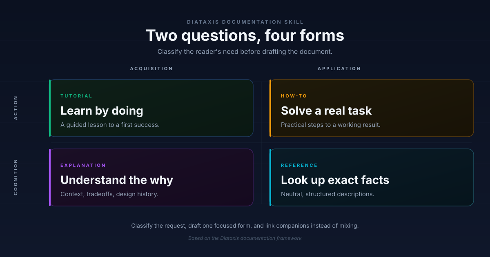

<div align="center">

# Diataxis Docs Skill

**A reusable OpenCode skill for writing structured, user-first technical documentation.**

[](LICENSE)
[](SKILL.md)
[](https://diataxis.fr/)
[](https://www.thegooddocsproject.dev/)
[](evals/evals.json)

[中文](README.zh-CN.md) · [Install](docs/installation.md) · [Commands](docs/commands.md) · [IDE integration](docs/ide-integration.md) · [FAQ](docs/faq.md)

</div>

<p align="center">
  
</p>

---

## What it does

Most documentation problems are classification problems. A page that teaches a beginner, guides a working user, lists API fields, and explains design tradeoffs at once fails all four readers.

This skill makes an AI assistant decide **what kind of document is needed** before it writes anything, using the [Diataxis](https://diataxis.fr/) compass:

| If the content… | …and serves the user's… | …then it belongs to… |
| --- | --- | --- |
| informs action | acquisition of skill | a tutorial |
| informs action | application of skill | a how-to guide |
| informs cognition | application of skill | reference |
| informs cognition | acquisition of skill | explanation |

The skill then writes in that form, and says what to leave out. [`SKILL.md`](SKILL.md) has the decision tree, the per-form anti-patterns, and the quality checks.

## Install

```bash
git clone https://github.com/88lin/diataxis-docs-skill.git \
  ~/.config/opencode/skills/diataxis-docs
```

For one project, run this from that project's root:

```bash
git clone https://github.com/88lin/diataxis-docs-skill.git \
  .opencode/skills/diataxis-docs
```

OpenCode has no `skills.paths` setting for arbitrary checkouts. With either supported location, the directory containing `SKILL.md` **must** be named `diataxis-docs` to match the skill's frontmatter `name`. Restart OpenCode afterwards.

Claude Code, verification steps, and troubleshooting are in [Install the skill](docs/installation.md).

## Use it

Ask in natural language:

```text
Turn this messy guide into Diataxis-style docs.
Split this page into tutorial, how-to, reference, and explanation.
Design a Diataxis documentation system for my SDK.
Audit our docs site and flag pages that mix forms.
```

Or use a slash command for a specific mode:

| Command | Returns |
| --- | --- |
| `/docs-classify` | Which form a page belongs to, plus mixed-form signals |
| `/docs-split` | A split plan and a draft of each resulting page |
| `/docs-review` | Severity-tagged pre-publication findings |
| `/docs-audit` | Page-by-page classification of a docs directory |
| `/docs-quickstart` | A short path to first success |

Full output shapes: [Slash commands](docs/commands.md).

The command files need a separate install step: OpenCode does not discover `.opencode/commands/` nested inside a skill checkout. See [Install the skill](docs/installation.md#install-the-slash-commands).

## See it work

[`examples/messy-to-diataxis/`](examples/messy-to-diataxis/) contains a realistic "Getting Started" page that does four jobs at once, and the four single-purpose pages it should become.

```text
BEFORE  before.md                # 1 page, 4 jobs

AFTER   after/01-tutorial.md     # learn by doing
        after/02-how-to.md       # complete a task
        after/03-reference.md    # look up facts
        after/04-explanation.md  # understand why
```

## Documentation

| Page | For |
| --- | --- |
| [Install the skill](docs/installation.md) | Getting it loaded in OpenCode or Claude Code |
| [Slash commands](docs/commands.md) | What each command takes and returns |
| [AI IDE integration](docs/ide-integration.md) | Exporting to Cursor, Copilot, Aider, and 8 more |
| [Develop and contribute](docs/development.md) | Running the checks, adding evals and commands |
| [Questions about scope and design](docs/faq.md) | What it does not do, and why |

Reference material the skill loads on demand: [blueprints](references/doc-blueprints.md) per document type, a [reader checklist](references/reader-analysis.md), a [template map](references/template-map.md) to Good Docs Project templates, and [Chinese-language anti-patterns](references/zh-cn-anti-patterns.md).

## Use it outside OpenCode

`SKILL.md` is portable. The exporter writes it to the rule file 11 other assistants read, with the frontmatter each one needs:

```bash
python scripts/export_rules.py --list
python scripts/export_rules.py --target . --compact
```

Eight of the eleven default targets load into every request, so `--compact` matters. The optional legacy Cursor target is excluded by default. See [AI IDE integration](docs/ide-integration.md).

## Design principles

- **Reader first.** Write for what the reader is trying to do right now.
- **One need per page.** Do not mix learning, working, lookup, and reflection.
- **Link, do not overload.** Companion documents beat a longer page.
- **Structure follows purpose.** Choose the document type before the headings.
- **A guide, not a plan.** Apply the compass where you are, one step at a time.

## Contributing

Issues and pull requests are welcome. Open an issue first for anything larger than a fix. Run `python scripts/check_local.py` before pushing — CI runs the same command.

See [CONTRIBUTING.md](CONTRIBUTING.md) and [Develop and contribute](docs/development.md).

## Sources

Built on ideas from [Diataxis](https://diataxis.fr/) and [The Good Docs Project](https://www.thegooddocsproject.dev/). This repository does not mirror either; it distills them into a skill.

## License

MIT. See [LICENSE](LICENSE).
