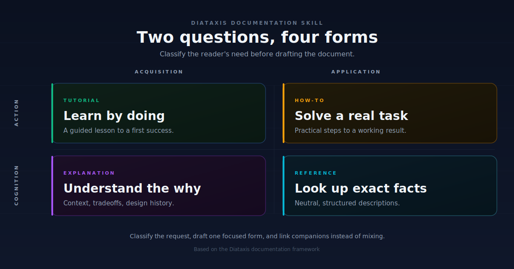

<div align="center">

# Diataxis Docs Skill 📚

**一个用于写作、重构和审查技术文档的 Opencode Skill。**

[](LICENSE)
[](SKILL.md)
[](https://diataxis.fr/)
[](https://www.thegooddocsproject.dev/)
[](evals/evals.json)
[](https://github.com/88lin/diataxis-docs-skill)

[英文文档](README.md) · [Skill 文件](SKILL.md) · [文档蓝图](references/doc-blueprints.md) · [模板映射](references/template-map.md)

</div>

---

## 预览

<p align="center">
  
</p>

```text
用户需求                 Diataxis 文档类型        输出形态
──────────────────────────────────────────────────────────────
通过动手来学习           Tutorial / 教程          有引导的学习体验
完成一个真实任务         How-to / 操作指南        清晰、可执行的步骤
查询准确事实             Reference / 参考文档     表格、字段、参数、规则
理解背后的原因           Explanation / 解释说明   背景、取舍、设计原因
```

---

## 目录

- [为什么要做这个 Skill](#为什么要做这个-skill)
- [它能帮你做什么](#它能帮你做什么)
- [不适合用在什么场景](#不适合用在什么场景)
- [核心工作方式](#核心工作方式)
- [仓库结构](#仓库结构)
- [安装方式](#安装方式)
- [示例提问](#示例提问)
- [斜杠命令](#斜杠命令)
- [完整示例](#完整示例)
- [内置文档蓝图](#内置文档蓝图)
- [设计原则](#设计原则)
- [它和普通写作助手有什么不同](#它和普通写作助手有什么不同)
- [本地开发](#本地开发)
- [跨 AI IDE 集成](#跨-ai-ide-集成)
- [常见问题](#常见问题)
- [资料来源](#资料来源)
- [贡献](#贡献)
- [许可证](#许可证)

---

## 为什么要做这个 Skill

很多技术文档的问题，不是“写得不够多”，而是“分类不清”。

一篇文档如果同时想完成这些目标，就很容易变得臃肿：

- 教新手入门
- 帮熟练用户完成任务
- 列出 API、字段、参数、命令
- 解释产品设计背后的原因
- 顺便处理故障排查

结果往往是：新手不知道从哪里开始，熟练用户找不到关键信息，维护者也不知道新增内容应该放在哪里。

这个 Skill 把 [Diataxis](https://diataxis.fr/) 框架沉淀成一个可复用的 AI 写作流程，让助手先判断“应该写哪一种文档”，再开始组织内容。

它的目标是：

- 先判断文档类型，再写正文
- 按读者当前状态写，而不是按作者脑子里的产品结构写
- 每一页只服务一个核心用户需求
- 把其它内容链接出去，而不是塞进同一篇文档
- 让文档系统长期更容易维护

“臃肿”的文档在实践中长什么样——下面是仓库里最小的一个完整示例：

```text
BEFORE  examples/messy-to-diataxis/before.md     # 1 页，同时干了 4 件事

AFTER   examples/messy-to-diataxis/after/
        ├── 01-tutorial.md                       # 教程
        ├── 02-how-to.md                         # 操作指南
        ├── 03-reference.md                      # 参考
        └── 04-explanation.md                    # 解释
```

完整的 before / after 在 [`examples/messy-to-diataxis/`](examples/messy-to-diataxis/)，下方的[完整示例](#完整示例)章节会带你走一遍拆分过程。

---

## 它能帮你做什么

适合用于这些文档任务：

- 写教程
- 写操作指南
- 写参考文档
- 写解释说明或概念文档
- 写快速开始
- 写 README
- 写故障排查文档
- 写术语表
- 写发布说明
- 写文档风格指南

尤其适合这些场景：

- 你的文档里教程、说明、参数表、背景解释混在一起
- 你想给一个项目设计完整文档体系
- 你想把旧文档按 Diataxis 重新拆分
- 你想让 AI 写出来的文档更像“真正给用户用的文档”
- 你想复用一个稳定的文档写作框架，而不是每次重新提示 AI
- 你想为 SDK、API 或开发者门户设计完整文档体系
- 你只想判断单页文档应该属于哪一种 Diataxis 类型
- 你想审查整站文档，标出哪些页面混了多种类型
- 你想把现有文档体系迁移到 Diataxis 上

## 不适合用在什么场景

这个 Skill 的边界是有意收窄的，下面这些场景请别用它：

- 营销文案、博客文章、非技术类写作
- 纯视觉内容，比如 UI mockup、幻灯片或设计稿
- 代码 review、重构或实现类工作
- 一两段就能回完的简短回答
- 在结构已经清晰的文档之间做翻译

如果一个请求关心的是“写什么内容”而不是“写哪种文档”，那它就不属于这个 Skill 的范围。

---

## 核心工作方式

这个 Skill 以 [Diataxis 罗盘](https://diataxis.fr/compass/) 为核心——一张只需要回答两个问题就能定位到唯一一种文档类型的真相表。

| 如果内容是…… | …且服务用户的…… | …那么它归入…… |
| --- | --- | --- |
| 指导行动 | 习得技能 | 教程 / Tutorial |
| 指导行动 | 应用技能 | 操作指南 / How-to |
| 传递认知 | 应用技能 | 参考 / Reference |
| 传递认知 | 习得技能 | 解释说明 / Explanation |

罗盘可以套用在单句、单页，也可以套用在一整份文档体系上。它既适用于新内容，也同样适用于需要被移动或重写的已有内容。

> "罗盘既可以用于需要文档化的用户场景，也可以用于文档自身——也就是那些可能需要被移动或改进的内容。它像很多好工具一样，用起来出奇地朴素。" — diataxis.fr/compass

### 快速决策树

如果你不确定一个请求应该属于哪种类型，可以按下面这棵决策树走一遍：

```text
读者当下到底想做什么？
│
├── 从零学习一项新技能？
│   ├── 需要一个完整、有引导的课程 → Tutorial / 教程
│   └── 想用最短路径拿到第一次成功 → Quickstart / 快速开始
│
├── 用已经会的技能去完成一个真实任务？
│   ├── 一般任务，目标是明确的       → How-to / 操作指南
│   └── 卡在某个错误上               → Troubleshooting / 故障排查
│
├── 查询某个具体的事实、字段、命令或参数上限？  → Reference / 参考文档
│
└── 想理解为什么这样设计、怎么运作？            → Explanation / 解释说明
```

这个 Skill 还内置了一个**反模式清单**，专门识别最容易踩的坑：把两到多种类型的内容混在同一页里。完整清单见 [`SKILL.md`](SKILL.md#anti-patterns-what-not-to-do)。

### 工作流哲学

Diataxis 是用作**指引**的，不是用作**计划**的。这个 Skill 沿用官方工作流：

- **把 Diataxis 当作指引，不是计划。** 在你所在的地方套用罗盘，不是你希望它在的地方。
- **不要纠结结构。** 把注意力放在内容质量上，结构会从工作中浮现。
- **一次只做一步。** 改小步，快速响应；每步做完就发布，再开始下一步。不要在动手前规划整套重写。
- **Diataxis 从内部改变文档结构。** 它不是套在已有内容上的模板；让工作有机生长，结构会自然浮现。

换句话说：一篇老老实实写出自己内容、但比较杂的页面，比一个空荡荡的"四象限齐整、三格都没东西"的文档站更有价值。

---

## 仓库结构

```text
.
├── SKILL.md
├── README.md
├── README.zh-CN.md
├── LICENSE
├── assets/
│   └── preview.svg
├── references/
│   ├── doc-blueprints.md
│   ├── reader-analysis.md
│   └── template-map.md
├── evals/
│   └── evals.json
├── examples/
│   └── messy-to-diataxis/
│       ├── README.md
│       ├── before.md
│       └── after/
│           ├── 01-tutorial.md
│           ├── 02-how-to.md
│           ├── 03-reference.md
│           └── 04-explanation.md
├── .opencode/
│   └── commands/
│       ├── docs-classify.md
│       ├── docs-split.md
│       ├── docs-review.md
│       ├── docs-audit.md
│       └── docs-quickstart.md
├── .github/
│   └── workflows/
│       └── ci.yml
├── tests/
│   └── test_audit_docs.py
└── scripts/
    ├── audit_docs.py
    ├── check_local.py
    └── export_rules.py
```

### 关键文件说明

| 文件 | 作用 |
| --- | --- |
| `SKILL.md` | Skill 主体，包含触发说明、分类逻辑、写作规则和质量检查 |
| `references/reader-analysis.md` | 写作前的读者分析清单 |
| `references/doc-blueprints.md` | 教程、操作指南、参考文档、解释说明等文档骨架 |
| `references/template-map.md` | Diataxis 类型和 The Good Docs Project 模板的映射关系 |
| `evals/evals.json` | 用于检查 Skill 效果的示例提示词 |
| `examples/messy-to-diataxis/` | 真实案例：一篇混乱的文档以及按 Diataxis 拆分后的四个版本 |
| `.opencode/commands/` | 显式斜杠命令（`/docs-classify`、`/docs-split`、`/docs-review`、`/docs-audit`、`/docs-quickstart`） |
| `.github/workflows/ci.yml` | 持续集成：校验 evals.json、内部链接和仓库结构 |
| `scripts/audit_docs.py` | 可选的混合文档反模式启发式扫描脚本 |
| `tests/test_audit_docs.py` | 文档反模式扫描脚本的单元测试 |
| `scripts/check_local.py` | 同样的校验，本地推送前可跑 |
| `assets/preview.svg` | GitHub 首页预览图 |

---

## 安装方式

### 方式一：克隆到 Opencode 技能目录

```bash
git clone https://github.com/88lin/diataxis-docs-skill.git ~/.config/opencode/skills/diataxis-docs
```

克隆完成后，重启 Opencode，让它重新加载 Skill 列表。

### 方式二：在 `skills.paths` 里添加路径

在 `opencode.json` 中加入：

```jsonc
{
  "skills": {
    "paths": ["~/.config/opencode/skills/diataxis-docs"]
  }
}
```

保存后重启 Opencode。

### 方式三：作为 Claude Code skill 使用

Claude Code 会从 `~/.claude/skills/<skill-name>/` 加载 skill，并使用同一个 `SKILL.md` 作为入口。可以把本仓库克隆或复制到那里：

```bash
git clone https://github.com/88lin/diataxis-docs-skill.git ~/.claude/skills/diataxis-docs
```

Claude Code 通常会自动检测新增或修改过的 skills。如果这是你第一次创建 `~/.claude/skills/`，或者 skill 没有出现，再重启 Claude Code 让 skill registry 重新加载。

> 注意：`.opencode/commands/` 目录里是 Opencode 的斜杠命令 prompt。核心 skill 指令在 `SKILL.md` 中，可以迁移到其它工具；命令发现方式取决于具体宿主工具。

---

## 示例提问

下面是一些这个 Skill 设计上能稳定处理的典型提问：

```text
帮我把这份混乱的产品文档拆成教程、操作指南、参考文档和解释说明。
```

```text
帮我给这个开发者工具写 README 和快速开始。
```

```text
把这个 API 页面改成真正的 reference 文档。
```

```text
审查这套文档，告诉我哪里混入了教程、说明、参考信息和故障排查。
```

```text
判断这一页文档应该属于哪种 Diataxis 类型。
```

```text
把现有文档体系迁移到 Diataxis。
```

```text
帮我写一份故障排查文档，覆盖用户最常踩的五个错误。
```

```text
重构这篇又教又列又讲又部署的大杂烩页面。
```

---

## 斜杠命令

Skill 在 [`.opencode/commands/`](.opencode/commands/) 下内置了显式的斜杠命令。当你希望 AI 稳定进入某种 Diataxis 模式、而不是靠自然语言触发时，可以直接用这些命令。

| 命令 | 作用 |
| --- | --- |
| `/docs-classify` | 用决策树给单页文档分类，标出混合类型 |
| `/docs-split` | 把混合类型页面拆成对的 Diataxis 文档并各自起草 |
| `/docs-review` | 发布前对草稿做带严重等级标记的审阅 |
| `/docs-audit` | 逐页审查整站文档或一组文档 |
| `/docs-quickstart` | 起草一个短而精的 quickstart，让用户尽快拿到第一次成功 |

每个命令文件里都写明了它的输入和输出格式。建议用法是：先读命令的 prompt，再把要处理的页面或路径粘进去。

---

## 完整示例

可以看 [`examples/messy-to-diataxis/`](examples/messy-to-diataxis/) 里的完整前后对比。`before.md` 是一篇真实的“Getting Started”页面，混了教程、操作指南、参考表和设计解释。`after/` 目录下展示了同样的内容应该怎么拆成四个目标明确的单类型页面。

这个示例刻意写得短，但足以代表真实项目中常见的“混在一起”模式。推荐流程是：

1. 打开 `before.md`，给每个小节打上 tutorial / how-to / reference / explanation 标签。
2. 按标签把小节归类。
3. 对每一类，按 `references/doc-blueprints.md` 里对应的骨架起新页。
4. 用一个简短的 overview 页面替换原页面，链向这四篇新页。

---

## 内置文档蓝图

这个 Skill 内置了这些文档骨架：

| 文档蓝图 | 适用场景 |
| --- | --- |
| Tutorial / 教程 | 给用户一个可完成、可验证的学习路径 |
| How-to / 操作指南 | 帮用户完成一个真实任务 |
| Reference / 参考文档 | 字段、参数、命令、配置、API、限制、返回值 |
| Explanation / 解释说明 | 概念、背景、设计原因、替代方案、取舍 |
| Quickstart / 快速开始 | 帮用户尽快拿到第一次成功体验 |
| README | 项目的第一印象和入口页 |
| Troubleshooting / 故障排查 | 症状、原因、解决方案和验证方式 |
| Glossary / 术语表 | 项目特定术语和定义 |
| Release notes / 发布说明 | 面向用户的版本变化说明 |

前 4 行（Tutorial、How-to、Reference、Explanation）是 Diataxis 核心 4 类；Quickstart 是面向“第一次成功”的 Tutorial 子类型；后 4 行（README、Troubleshooting、Glossary、Release notes）是从 Good Docs Project 模板映射过来的邻近类型，详见 [`references/template-map.md`](references/template-map.md)。

对于更大的文档系统，它还可以帮助规划：

- SDK 入门路径
- API 或 CLI 参考文档结构
- 开发者门户导航
- 可运行代码示例需求
- 文档版本管理和发布说明结构
- Markdown、Docusaurus、ReadTheDocs、Mintlify、GitBook 或仓库文档等平台形态

---

## 设计原则

- 读者优先：先判断用户当前到底想完成什么。
- 一页一事：不要把学习、操作、查询和解释混在同一篇文档里。
- 链接而不是堆叠：相关但不同类型的内容应拆到配套文档中。
- 结构服从目的：先决定文档类型，再决定标题和章节。
- 实用优先：Diataxis 是工作工具，不是装饰性的术语。

---

## 它和普通写作助手有什么不同

普通写作助手追求“写得更通顺”。这个 Skill 追求的是**选对文档类型**。

| 普通写作助手 | Diataxis Docs Skill |
| --- | --- |
| “这是一篇写得不错的文档。” | “这是当前读者最应该读的那一种文档。” |
| 把请求当写作任务处理。 | 把请求当分类任务处理。 |
| 默认把教程、操作指南、参考文档、解释说明混在一起。 | 主动拆分、剪枝、改写，保持一页只服务一个用户需求。 |
| 鼓励“信息全面”。 | 鼓励“聚焦 + 链接出去”。 |
| 不告诉 AI 不该做什么。 | 内置一份明确的反模式清单。 |
| 用文笔质量来评估。 | 用分类准确性和类型分离来评估。 |

如果你只要通顺的文笔，那这个 Skill 不是为你准备的。如果你希望 AI 先把**文档形状**选对，那它就是。

---

## 本地开发

贡献者推送前可以跑同样的 CI 校验：

```bash
python scripts/check_local.py
```

脚本会检查：

- `evals/evals.json` 是合法 JSON，有必需的顶层字段，每条 eval 都有 `id`、`category`、`prompt`、`expected_output` 和 `files`。
- 每条 eval 的 `id` 唯一，`category` 在已知列表内。
- 内部 Markdown 链接都指向真实存在的文件和标题锚点。
- Markdown 文件里没有隐藏的零宽字符。
- audit_docs.py 的单元测试通过。
- 必需文件（skill 主体、references、examples、commands、CI）都存在。
- `SKILL.md`、`evals/evals.json` 和 `CHANGELOG.md` 的当前版本一致。

CI 定义在 [`.github/workflows/ci.yml`](.github/workflows/ci.yml)，对 `master` 分支的每次 push 和 PR 都会跑。

### 可选的文档反模式扫描

你可以先用启发式扫描器检查已有文档目录，找出疑似混合 Diataxis 类型的页面，再交给 AI 做进一步审查：

```bash
python scripts/audit_docs.py docs/
```

这个脚本刻意保持保守，只报告代码块、表格、步骤式语句、解释性词汇等证据；它不会宣称自己能权威分类页面。

---

## 跨 AI IDE 集成

虽然这个仓库本身是按 Opencode skill 的结构组织的，但 `SKILL.md` 里的核心 Diataxis 指导可以移植到其它 AI 编程助手——不过每个工具都有自己的约定，你可能需要按所选工具的格式做一点适配。

现代 AI 编程生态很碎片化。为了让你能在团队偏好的工具里贯彻 Diátaxis 标准，我们提供了一个通用导出脚本，自动把 Diataxis 规则写到 **11 个主流 AI 助手的 12 个标准 rules 文件路径**：

| AI 工具 | 目标文件 / 路径 |
| :--- | :--- |
| **Cursor** | `.cursorrules` / `.cursor/rules/diataxis.md` |
| **Cline / Roo Code** | `.clinerules` / `.roo/rules/diataxis.md` |
| **Windsurf** | `.windsurfrules` |
| **GitHub Copilot** | `.github/copilot-instructions.md` |
| **Claude Code** | `CLAUDE.md` |
| **OpenAI Codex** | `AGENTS.md` |
| **Aider** | `CONVENTIONS.md` |
| **Gemini CLI** | `GEMINI.md` |
| **Continue** | `.continue/rules/diataxis.md` |
| **Amazon Q Developer** | `.amazonq/rules/diataxis.md` |

在需要接收 rules 文件的项目目录下运行这个脚本：

```bash
# 在本仓库内运行，会导出到本仓库：
python scripts/export_rules.py

# 在其它项目中运行，会把这个 skill 的规则导出到当前项目：
python /path/to/diataxis-docs-skill/scripts/export_rules.py
```

*注：脚本会从这个 skill 仓库读取 `SKILL.md`，并把 rules 文件写入当前工作目录。它会自动创建必要的隐藏目录（比如 `.github/`），但**绝不覆盖**已有的 rules 文件。*

### 工具适配说明

脚本会把核心指导写到标准路径，但有几个工具还需要做一点手动调整才能完整生效：

- **Cursor (New Rules) 和 Roo Code**：这两个工具在 rules 文件（`.cursor/rules/diataxis.md` 或 `.roo/rules/diataxis.md`）里带 `description:` 字段的 YAML frontmatter 时效果最好。建议在生成的文件最顶部加上：

  ```yaml
  ---
  description: Diataxis documentation guidelines
  ---
  ```

- **Aider**：生成 `CONVENTIONS.md` 只是第一步，还必须在 `.aider.conf.yml` 的 `read:` 列表里显式加入这个文件，Aider 才会加载它：

  ```yaml
  read:
    - CONVENTIONS.md
  ```

---

## 常见问题

**Q：这个 Skill 只是 Diataxis 网站的摘要吗？**

不是。它把 Diataxis 蒸馏成一个 AI 可以直接使用的工作流，并补上了 Good Docs Project 映射、每种类型的文档蓝图、每种类型的反模式清单，以及大系统下的结构化规划。它是给 agent 加载的，不是给人类读的。

**Q：这个 Skill 会取代人吗？**

不会。它让 AI 在“写哪种文档”这个决定上更准。语气、准确性、最终结构仍然由人决定。

**Q：完全不懂 Diataxis 也能用吗？**

可以。决策树、反模式清单、文档蓝图都是为完全没读过 Diataxis 原文的读者设计的。

**Q：这个 Skill 支持哪些语言？**

框架本身是语言无关的。仓库内附的 README 是中英双语，实际应用时 AI 会按用户写的语言来执行。

**Q：这个 Skill 是怎么评估的？**

仓库内置 [`evals/evals.json`](evals/evals.json)，目前包含 30 多条评测用例，跨越 11 个类别，覆盖分类、检测混合类型、每种类型的写作、审查、迁移、大系统规划、相邻类型、反模式规避，以及显式不触发（non-trigger）用例。每个用例都标注了 category 和 expected output shape，方便追踪回归。

**Q：这个 Skill 会帮我写代码示例吗？**

只在 tutorial 或 reference 文档里会涉及示例。Skill 的本职是选对文档类型，代码本身要由你来提供，因为只有你最懂自己的产品。

**Q：怎么加一个新的斜杠命令？**

在 `.opencode/commands/` 下新建一个 markdown 文件，frontmatter 里写上 `name` 和 `description`。正文里写清任务、输入和期望的输出格式。可以参考 `docs-classify.md` 或 `docs-audit.md`，这两个是最小可用的范例。

**Q：怎么加一条新的 eval？**

在 `evals/evals.json` 的 `evals` 数组里加一个对象，包含 `id`、`category`、`prompt`、`expected_output` 和 `files`。`id` 必须唯一，`category` 必须是校验脚本里列出的已知值之一。改完后跑 `python scripts/check_local.py` 确认。

---

## 资料来源

这个 Skill 主要参考和吸收了：

- [Diataxis](https://diataxis.fr/)
- [The Good Docs Project](https://www.thegooddocsproject.dev/)

本仓库没有镜像这些网站内容，而是把它们的核心思想整理成可复用的 Opencode Skill。

---

## 贡献

欢迎提交 issue 和 pull request。

如果你想提一个比较大的改动，建议先开 issue。这样更容易保持这个 Skill 的聚焦，不会被某一种文档风格带偏。

比较适合贡献的方向包括：

- 优化 `SKILL.md` 的触发描述
- 增加更好的文档蓝图
- 增加更真实的 eval 示例
- 补充实际文档改造案例
- 补充 SDK、API、开发者门户案例
- 改进中文或英文表达

请尽量保持风格：实用、读者优先、符合 Diataxis 的分类逻辑。

---

## 许可证

MIT。详见 [LICENSE](LICENSE)。
